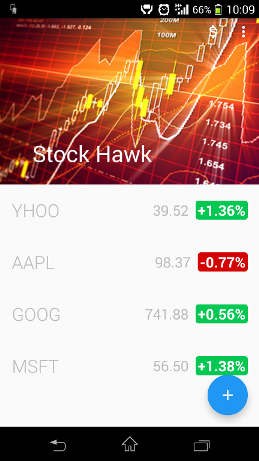
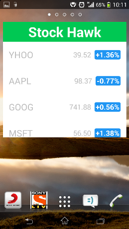
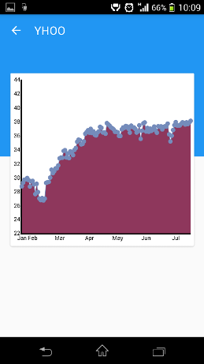

# StockHawk

Project for the Android NanoDegree program from Udacity

## Features
 * Add stocks of companies to monitor at an hourly interval
 * Look at the past records of stock prices in a graphical view
 * Add widget to your homescreen
 
## Libraries
 * [WilliamChart](https://github.com/diogobernardino/WilliamChart)
 * [OkHttp](http://square.github.io/okhttp)
 * [stetho](https://github.com/facebook/stetho)

## Screens
    
